## TT-60/60 keyboard
60 keys ona a 60% form factor

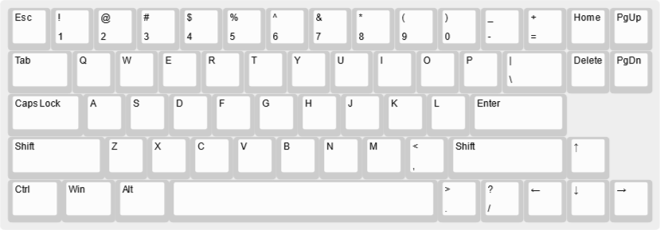

## keyboard-layout-55p

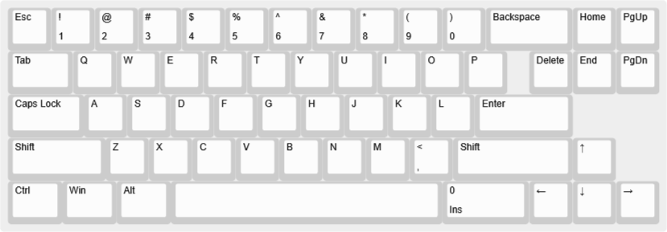

## TT-60-arrows keyboard
60% form factor with arrows

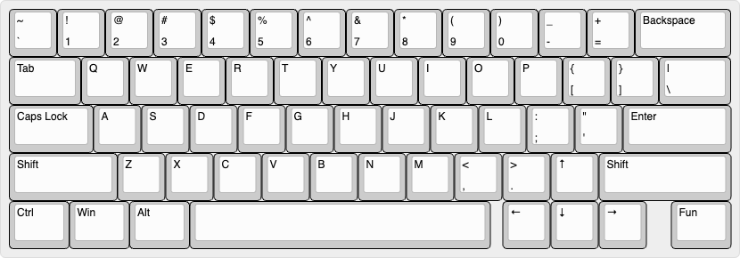

## TT-60/40 keyboard
60% form factor containing 40% form factor

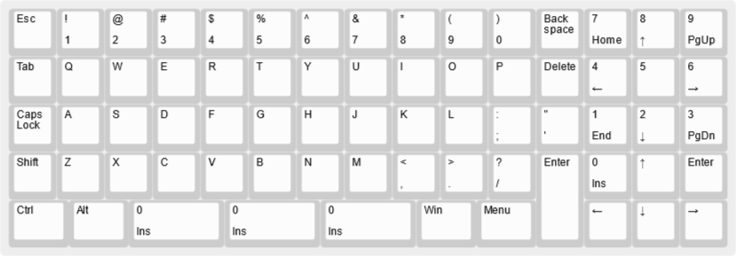

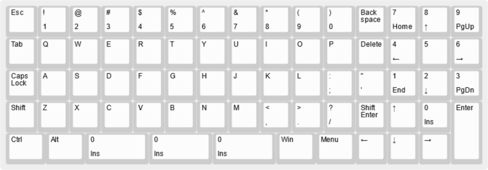

## 60 paw
60% keyboard layer including a NumPad located at the South Paw.

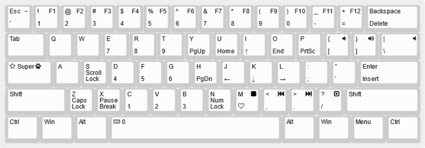

## the slimmest

The slimmest keyboard for those masochists who still prefer the staggered layout.

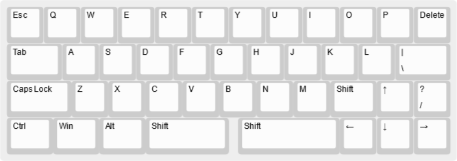

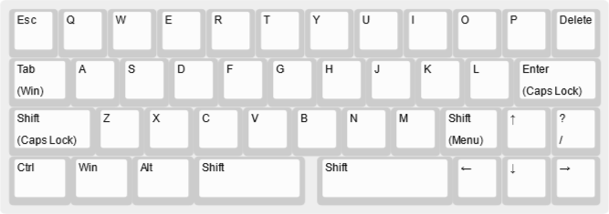

## TT 100111B -- the smallest 

The smallest usable keyboard.

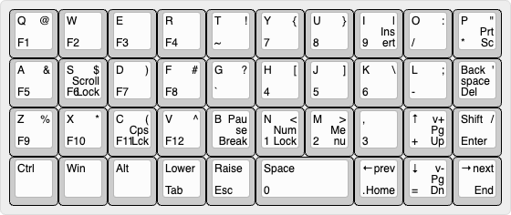

## WMK-TT-40
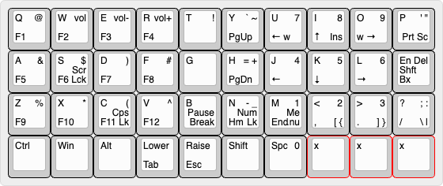

## WMK-TT-40 (WIP)
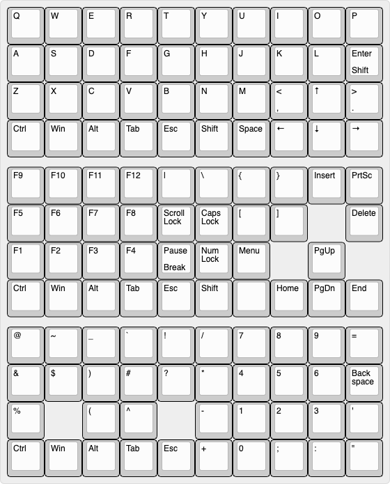

## TT-alt-macropad

The alt macropad for desperate planck users xD

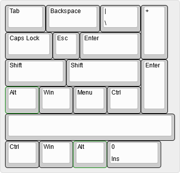
